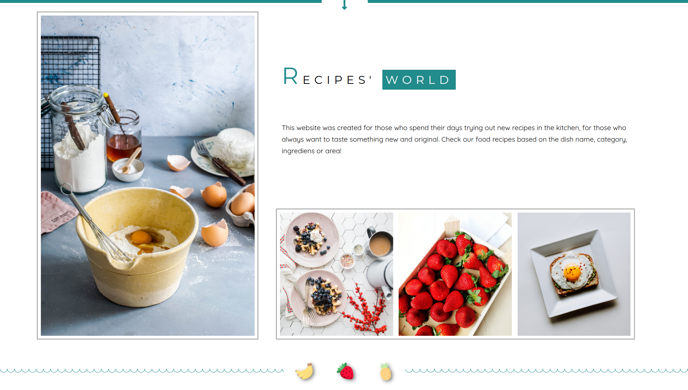
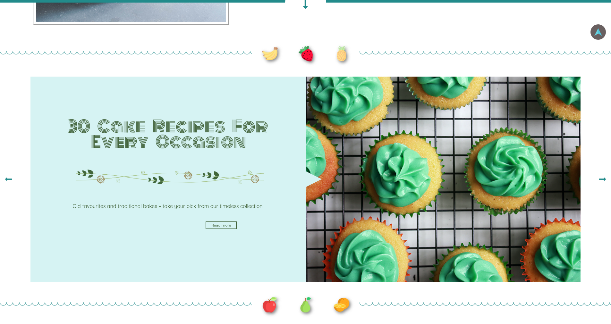
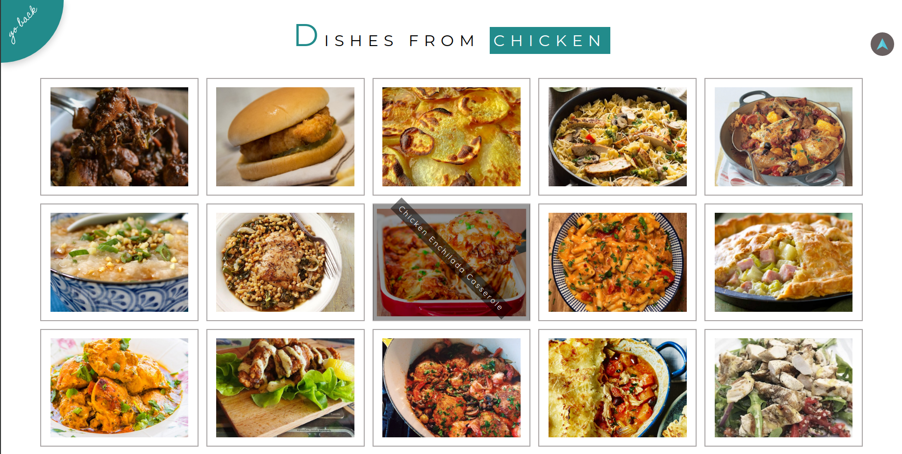
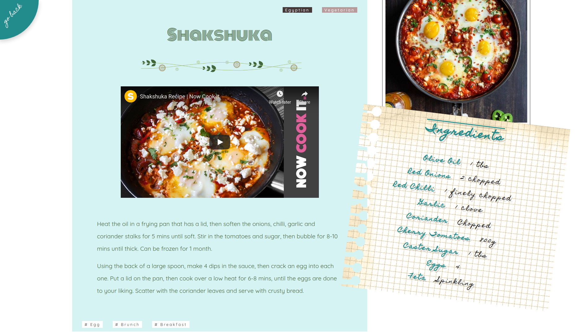

# Recipes' World

## Description

The "Recipes' World" website gathers recipes using a free [The Meal Database](https://www.themealdb.com/). The recipes are divided based on their name, category, ingredients and area. Every recipe on the website consists of the ingredients, instructions (thanks to the marking function it's possible to save the progress of the recipe), recipe's tags and video how to prepare the dish. The blog section consists of example posts with photos, dates, post's tag, the options to like or share the blog post and the comments section with example comments.

The website is supported on every screen thanks to the RDW (responsive web design). The features changes based on the screen resolution (from mobile through tablets to computers). 

## Live Demo
[Recipes' World - live preview](https://cenora6.github.io/Recipes-World/)
 
## Technologies and additional dependencies:

| Tool | Description |
| :-------------:|--------------|
| [React](https://www.npmjs.com/package/react/) | A JavaScript library for creating user interfaces. |
| [Typescript](https://www.npmjs.com/package/typescript/) | An open-source language which builds on JavaScript, |
| [SASS](https://www.npmjs.com/package/sass/) | A preprocessor scripting language that is interpreted or compiled into CSS.  |
| [Node Sass](https://www.npmjs.com/package/node-sass/) | A library that provides binding for Node.js to LibSass, the C version of the popular stylesheet preprocessor, Sass. |
| [React Router Dom](https://www.npmjs.com/package/react-router-dom/) | DOM bindings for React Router. |
| [Axios](https://www.npmjs.com/package/axios/) | Promise based HTTP client for the browser and node.js |
| [CSS reset and normalize](https://www.npmjs.com/package/css-reset-and-normalize) | A combination of css reset and normalize (available in CSS, SCSS, Stylus and LESS). |
| [React Scroll](https://www.npmjs.com/package/react-scroll/) | Component for animating vertical scrolling. | 
| [Slick Carousel](https://www.npmjs.com/package/slick-carousel) | A fully responsive carousel. | 
| [React Slick](https://www.npmjs.com/package/react-slick) | Carousel component built with React. It is a react port of slick carousel | 
| [React Player](https://www.npmjs.com/package/react-player) | A React component for playing a variety of URLs, including file paths, YouTube, Facebook, Twitch, SoundCloud, Streamable, Vimeo, Wistia, Mixcloud, and DailyMotion. | 

## Installation:
[node.js](http://nodejs.org/download/) is required to use ``npm``.

-  ```git clone https://github.com/Cenora6/Recipes-World.git``` to clone the repository
- ```npm install``` to install all dependencies
- ```npm start``` and ```http://localhost:3000/``` in the browser to preview the website
